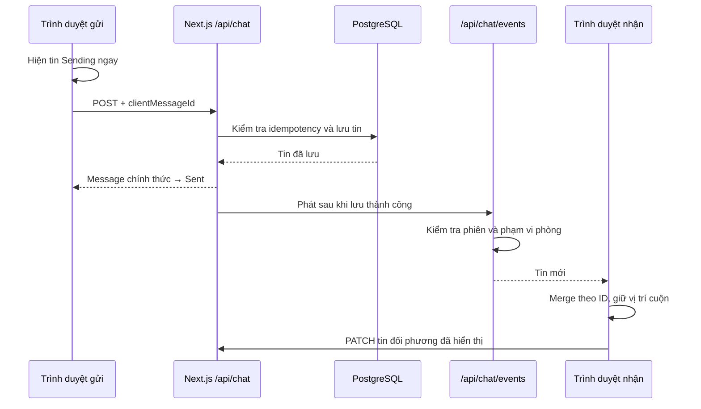

# Jewish Horse — giao diện, trải nghiệm cửa hàng và chat realtime

Ngày cập nhật: 2026-10-02.

## Phạm vi

Đợt này cải thiện sản phẩm Next.js hiện có, giữ cách deploy Docker/Render và các luồng nghiệp vụ. Không chuyển dữ liệu sang một nền tảng commerce/helpdesk khác. Không thêm dịch vụ Rails, Redis, worker hoặc gói npm chạy nền.

Các phần được thay đổi: theme dùng chung; tìm kiếm/sắp xếp catalog; trạng thái chờ tải; gửi/nhận chat; bản nháp và công cụ trả lời của admin; đồng bộ badge; kiểm thử và smoke test standalone.

## Tham khảo Medusa và Chatwoot

Đã đọc source cụ thể thay vì chỉ xem README. Các mẫu tương tác được triển khai lại bằng React/Next.js theo dữ liệu của shop; không chép source, logo hoặc thành phần Enterprise từ hai repo.

| Nguồn đã xem | Điểm áp dụng vào shop |
| --- | --- |
| [Medusa DataTableRoot](https://github.com/medusajs/medusa/blob/044fbbb9f3bb749fdb52a862b542dc3982e7cba7/packages/admin/dashboard/src/components/table/data-table/data-table-root/data-table-root.tsx) | Tìm kiếm, sắp xếp, trạng thái không có kết quả và khu vực dữ liệu cuộn độc lập. Catalog có tìm theo tên/mô tả/nhóm, lọc còn hàng, sắp giá hoặc tên; thao tác chỉ thay phần danh sách. |
| [Medusa skeleton components](https://github.com/medusajs/medusa/blob/044fbbb9f3bb749fdb52a862b542dc3982e7cba7/packages/admin/dashboard/src/components/common/skeleton/skeleton.tsx) | Khung giữ chỗ khi tải hội thoại, có thông báo cho trình đọc màn hình và hỗ trợ reduced motion. Không đặt loading boundary ở toàn site để giữ mã HTTP 404 của sản phẩm không tồn tại. |
| [Chatwoot conversation actions](https://github.com/chatwoot/chatwoot/blob/843385ff3a01c9c0d35646bb45a0e5e9950477b2/app/javascript/dashboard/store/modules/conversations/actions.js) | Tin chờ gửi, gửi lại khi lỗi, hợp nhất dữ liệu theo ID, chống request lịch sử chồng nhau, lấy bù sau reconnect và giữ vị trí đọc. |
| [Chatwoot ReplyBox](https://github.com/chatwoot/chatwoot/blob/843385ff3a01c9c0d35646bb45a0e5e9950477b2/app/javascript/dashboard/components/widgets/conversation/ReplyBox.vue) | Bản nháp riêng từng hội thoại, giữ bản nháp khi điều hướng, trả lời nhanh và phím tắt. |
| [Chatwoot MessageStatus](https://github.com/chatwoot/chatwoot/blob/843385ff3a01c9c0d35646bb45a0e5e9950477b2/app/javascript/dashboard/components-next/message/MessageStatus.vue) | Trạng thái gửi hiển thị ngay trên tin. Shop phân biệt Sending / Sent / lỗi; Sent nghĩa là đã lưu thành công, không có nghĩa khách đã đọc. |

Tài liệu tham khảo thêm: [Medusa Data Table](https://docs.medusajs.com/ui/components/data-table), [Chatwoot hướng dẫn các thao tác hội thoại](https://www.chatwoot.com/hc/user-guide/articles/1677235281-lesson-3-a-mastering-core-features).

## Giao diện và cửa hàng

- Bố cục hero, carousel, ảnh, sản phẩm, giỏ hàng và checkout tiếp tục dùng các component hiện có.
- Nền than `#111318`, card `#1B2028`, chữ trắng/xám; xanh `#95D47A` cho nhận diện và hành động chính, tím `#B6A3FF` cho điểm nhấn, hổ phách cho ngữ cảnh lịch hẹn.
- Admin và chat dùng bề mặt sáng trung tính. Giảm bóng/blur lớn, giữ Minecraft ở nhận diện và Inter ở nội dung thao tác.
- Catalog lọc/sắp xếp tại client từ danh sách hiện có, không thêm request khi gõ. `useDeferredValue` giữ ô nhập phản hồi khi danh sách thay đổi. Thứ tự mặc định vẫn là thứ tự catalog do server trả về.
- Giá để sắp xếp là giá VND hiện hành, gồm giá sale; hiển thị USD/VND/LTC và luật thanh toán không đổi.
- Ảnh trong danh sách tải lazy và decode bất đồng bộ, giữ khung ảnh hiện có để hạn chế nhảy bố cục.
- Kết quả tìm kiếm rỗng có nút xóa lọc; không thay cho trạng thái catalog rỗng hoặc lỗi database.

## Chat: luồng gửi và nhận

### Gửi tin

- Tin tạm xuất hiện ngay khi bấm gửi; không đợi POST rồi GET lại lịch sử.
- POST trả tin đã lưu để thay tin tạm. Cả POST và SSE có thể tới trước; merge loại bỏ bản trùng.
- Hàng đợi riêng mỗi phòng giữ thứ tự gửi, cho phép nhập và xếp tin tiếp theo trong khi tin trước đang gửi.
- Timeout/lỗi có nút Retry send. Retry dùng lại `clientMessageId`. Server băm phạm vi gồm vai trò, tài khoản, phòng và mã tin thành `requestKey` unique, xử lý cả hai POST trùng chạy đồng thời.
- Ảnh vẫn dùng PNG/JPEG/WebP tối đa 1 MB, tối đa 30 ảnh/phòng, URL riêng tư và cơ chế xóa sau 90 ngày hiện có. Preview dùng object URL cục bộ, được thu hồi khi không dùng.
- Trạng thái đang gửi/lỗi và file chờ gửi nằm trong bộ nhớ của panel; không phải outbox bền vững khi đóng tab. Bản nháp chữ được lưu riêng như phần bên dưới.

### Nhận tin và đọc lịch sử

- Một EventSource được chia sẻ giữa các component trong mỗi tab. Header, widget và inbox nhận cùng sự kiện để cập nhật badge.
- Sự kiện có nội dung chỉ được phát cho khách sở hữu phòng hoặc admin có quyền, sau khi kiểm tra phiên; đăng xuất/thu hồi phiên không được tiếp tục cấp dữ liệu qua API.
- Heartbeat mỗi 15 giây, tối đa 8 kết nối/tài khoản, kết nối được làm mới sau 5 phút; cleanup khi client ngắt.
- Reconnect lấy bù theo cursor. Một lượt đối chiếu 30 giây khi trang hiển thị xử lý sự kiện bỏ lỡ và dữ liệu ghi từ luồng khác. Đây cũng là đường dự phòng nếu stream không hoạt động.
- Lịch sử tải theo trang 60 tin, sắp `(createdAt, id)` để không bỏ sót các tin cùng timestamp. Nút Load earlier messages tải phần cũ và giữ vị trí cuộn.
- Khi đang đọc phía trên, tin mới không kéo người dùng xuống cuối; có nút New messages below.
- Read marker chỉ tăng tới thời điểm của tin đối phương được acknowledge. Panel mới gửi PATCH khi phòng hiển thị và người dùng ở gần cuối. GET mặc định giữ read-on-open cho client cũ; panel mới luôn dùng `read=0`.
- Admin gửi tin kiểm tra trực tiếp phòng mục tiêu thay vì tải toàn danh sách phòng/unread/đơn hàng. Lấy danh sách phòng được tách khỏi lấy tin.

### Bản nháp và thao tác admin

- Bản nháp chữ nằm trong `sessionStorage`, tách theo tài khoản và phòng, tồn tại qua điều hướng/reload trong tab hiện tại. Không đồng bộ bản nháp giữa thiết bị và không lưu ảnh đính kèm vào storage.
- Đăng xuất qua giao diện xóa bản nháp của shop trong tab. Tài khoản khác có namespace riêng.
- Quick replies gồm Welcome, Payment steps và Appointment, dùng nội dung phù hợp quy trình của shop. Chọn chỉ chèn vào ô soạn để admin sửa; không tự gửi và không tự xác nhận thanh toán/lịch hẹn.
- `Alt+R` tập trung ô trả lời; `/` tập trung tìm hội thoại khi không gõ trong input; Enter gửi và Shift+Enter xuống dòng như trước.
- Trên desktop, danh sách hội thoại và lịch sử cuộn độc lập, thanh tìm kiếm ở đầu danh sách; tránh làm cả trang dài theo số khách.

## Bảo toàn các tính năng hiện có

| Nhóm | Hành vi tiếp tục được giữ |
| --- | --- |
| Tài khoản | Email/mật khẩu, Google, đổi/reset mật khẩu qua quy trình hỗ trợ, giới hạn đăng nhập, thu hồi phiên, khóa/mở và ẩn danh khách |
| Sản phẩm | Package, ảnh, dịch thuật đang dùng, giá sale, tồn kho, các trường giao hàng và thiết lập hiển thị |
| Mua hàng | Giỏ lưu trên thiết bị, sửa số lượng, checkout, kiểm tra/giữ tồn và thời hạn giữ hàng |
| Thanh toán | VietQR, VND, Litecoin, tỷ giá tự động/cố định, TXID và các quy trình đối soát hiện có |
| Lịch hẹn | Khung giờ khách chọn, ASAP, admin xác nhận/chốt lịch, calendar/ICS và thông tin giao riêng tư |
| Đơn hàng | Danh sách/chi tiết, trạng thái, timeline, ghi chú nội bộ, hoàn tất/hủy/trả tồn và lịch sử email |
| Hỗ trợ | Phòng khách–admin, chat sau thanh toán, tin tự động, ảnh riêng tư, unread, widget và inbox |
| Admin | Overview, Customers, Activity, Products, Payments, Email, Admins, Announcements và presence của đội ngũ |
| Thông báo | Inbox, badge, Gmail, nhắc lịch và housekeeping hiện có; không thêm thông báo thiết bị |
| Triển khai | Docker multi-stage, Next standalone, Prisma/PostgreSQL, startup migrate deploy, Render và health check |

Các bảng nghiệp vụ và route cũ không bị thay bằng mô hình dữ liệu Medusa/Chatwoot. Ma trận trên mô tả phạm vi giữ lại; kết quả test được ghi ở phần xác minh, không dùng lời hứa “100%” để thay cho kiểm thử.

## API và migration

- `POST /api/chat`: thêm `clientMessageId` tùy chọn; tiếp tục hỗ trợ JSON và multipart. Response `{message}` như trước.
- `GET /api/chat`: thêm `rooms=only`, `rooms=0`, `read=0`, `after`, `before`; response có `cursor`, `oldest`, `hasMore`, `hasOlder`.
- `PATCH /api/chat`: acknowledge `{id, room}`; khách chỉ có thể đánh dấu tin trong phòng của chính mình.
- `GET /api/chat/events`: SSE có sự kiện `ready` và `change`; cookie cùng origin, không có token trên URL.
- `Server-Timing` ở GET/POST để phân biệt thời gian server với cảm giác chờ trên giao diện.
- Migration `20261002120000_chat_delivery` thêm hai cột nullable `ChatMessage.requestKey`, `ChatMessage.clientMessageId` và unique index. Dữ liệu cũ và client cũ vẫn dùng được; không xóa tin hoặc thay đổi đơn hàng.

## Deploy vẫn như cũ

Không đổi Dockerfile, compose, Render blueprint hoặc lệnh startup. Startup hiện có chạy migration trước khi khởi động Next.js. Khi deploy bản này, migration mới phải được chạy trước app mới; pipeline hiện tại đã đảm nhiệm bước đó.

SSE hoạt động trong cấu hình một Node process/instance. Đã có smoke test kiểm tra POST và route SSE dùng chung bus trong bundle standalone. Nếu sau này tăng nhiều process/instance, cần event bus dùng chung; bộ nhớ trong một process không tự đồng bộ sang instance khác. Lượt đối chiếu định kỳ giúp phục hồi dữ liệu nhưng không thay cho realtime giữa các instance.

Render Free vẫn có thể ngủ sau thời gian không có lưu lượng; cải tiến này không loại bỏ cold start. Xem [Render Free](https://render.com/docs/free). Region trong blueprint không chứng minh region dịch vụ đang chạy; không tự thay region/gói máy/database trong đợt này.

Rollback app có thể giữ hai cột nullable mới. Không drop cột trong rollback khẩn cấp; code cũ bỏ qua chúng. Các kiểm thử ghi dữ liệu chỉ chạy trên E2E database riêng.

## Xác minh và số đo

- TypeScript bản cuối và 101 unit test đã qua.
- Bốn E2E chuyên biệt cho chat đã qua: concurrent retry, read acknowledgement riêng tư, phân trang cùng timestamp, optimistic send, lỗi/gửi lại, SSE giữa trình duyệt, reconnect và cách ly stream.
- 37 ca E2E cũ và 6 ca mới đều có lượt kiểm tra đạt, qua nhiều đợt chạy. Lượt regression đầu đạt 29/37; 8 ca gặp 503/timeout đã qua khi chạy lại nhóm accounts/admin. Nhóm 23 ca sau đó đạt 22/23; ca còn lại là kiểm tra storage trong lúc logout chuyển trang, đã sửa bài test chờ URL login và chạy lại đạt. Không tính đây là một lượt chạy 43 ca liên tục không lỗi.
- Kiểm tra bổ sung cửa hàng phát hiện loading boundary toàn site làm URL sản phẩm không tồn tại trả HTTP 200. Đã bỏ boundary đó, giữ skeleton bên trong chat; ca 404 chạy lại đạt và được xác nhận thêm trên bản production. Bản nháp, trả lời nhanh và tìm kiếm/sắp xếp catalog đều đã qua E2E.
- Build production bản cuối và smoke standalone đã qua. Typecheck được chạy lại sau khi trả cấu hình TypeScript tự sinh về cấu hình gốc.
- Smoke standalone xác nhận POST và SSE truyền cùng ID tin, retry trả cùng ID. Máy phát triển không có Docker CLI, nên không báo đã chạy container Linux thực tế.
- Mẫu đo 12 POST văn bản liên tiếp từ Next standalone local tới Neon E2E từ xa: p50 512 ms, p95 1172 ms, min 382 ms. Smoke bản cuối gồm receipt + SSE 472 ms (lượt trước 1343 ms). Đây là phép đo local ít mẫu, không phải SLA/p95 production trên Render hoặc kiểm thử tải nhiều người dùng.
- Đã kiểm tra storefront và admin chat ở 390/768/1440 px: không tràn ngang, không có exception trình duyệt, chiều cao inbox desktop được giới hạn; đã xem ảnh để kiểm tra bố cục. Ảnh tại `.local-cache/review-chat/*-final-*.png`, log trong `.local-cache/`, không đưa dữ liệu kiểm thử vào bundle.

Môi trường E2E dùng branch riêng đã migrate và seed. Các lượt chạy lại dùng endpoint pooler của chính branch đó và cấu hình tạm bỏ bước setup đã hoàn thành; không đổi `.env` hay cấu hình deploy. Máy phát triển không có Docker CLI; standalone được kèm static/public/Prisma engine tương ứng các bước copy trong Dockerfile. Chưa đo p50/p95 chat trên production.

## Deploy production — 2026-10-02

- Theo yêu cầu deploy của chủ shop, đã push commit `e91bb92cebf64e3b3a623b56cc143a02e99e4f38` lên `origin/main`. Render tự build Docker theo cấu hình hiện có.
- Deploy `dep-davth08ae00c73e03l1g` đạt `live` lúc **23:17:30 ngày 02/10/2026, giờ Việt Nam** (16:17:30 UTC), tại https://jewish-horse.onrender.com/en.
- Migration `20261002120000_chat_delivery` hoàn thành lúc 16:17:21 UTC. Kiểm tra chỉ đọc trên database production xác nhận hai cột mới và unique index đã tồn tại, không có rollback.
- Kiểm tra production: health/trang chủ/login 200; chat/SSE 401 khi chưa đăng nhập; admin counts 403; admin chat chuyển tới login; sản phẩm không tồn tại 404. Google login vẫn bật, dev-admin tắt. Hai ID sản phẩm catalog giữ nguyên so với trước deploy.
- Trình duyệt desktop 1440 px và mobile 390 px: theme mới, tìm kiếm/xóa bộ lọc hoạt động, không tràn ngang hoặc exception JavaScript. Ảnh tại `.local-cache/review-chat/render-live-*.png`.
- Kiểm tra trên website thật không tạo tài khoản, đơn hàng hoặc gửi tin thử cho khách/admin. Kết quả gửi/nhận qua hai trình duyệt được xác minh ở môi trường E2E và standalone; đây không phải kiểm thử tải production.
- Commit live trước đợt này là `0dc4051d2bbc4e15a6a90f655bae08888ff2f8e6`, deploy `dep-dav7g33ncjis73dbv9mg`; có thể dùng làm mốc rollback ứng dụng, giữ nguyên hai cột nullable mới.

## Độ mượt giao diện — đợt 2 (2026-10-02)

Chủ shop nhận xét phần "mượt như Medusa/Chatwoot" chưa làm. Đợt này chỉ sửa cách trang tải, cuộn và phản hồi thao tác; không đổi bố cục, nội dung hay luồng nghiệp vụ, không thêm thư viện.

| Vấn đề trước đây | Cách sửa | Tệp |
| --- | --- | --- |
| Font tải qua hai stylesheet ngoài nối tiếp (`@import` Google Fonts và cdnfonts); font Minecraft không có `font-display` nên tiêu đề bị ẩn tới khi tải xong | Inter tự host trong `public/fonts` (3 subset woff2 latin/latin-ext/vietnamese, giấy phép OFL kèm theo), `font-display: swap`, preload subset latin trong `<head>`; Minecraft khai báo `@font-face` riêng trỏ thẳng file woff (swap) và preconnect | `globals.css`, `src/app/layout.tsx`, `public/fonts/` |
| Cuộn bị nặng: nền `background-attachment: fixed`, lớp ảnh toàn màn hình có `filter: blur`, các lớp trang trí mờ | Bỏ fixed attachment và blur (các lớp này chỉ hiện 3–8% nên nhìn gần như không đổi); lớp nền cố định được đưa lên compositor (`will-change`) nên cuộn không phải vẽ lại | `globals.css` |
| `transition: all` trên nút, link, thẻ sản phẩm | Chỉ chuyển động các thuộc tính thay đổi (màu, viền, bóng, transform) | `globals.css` |
| Bấm link không có phản hồi khi trang mới đang tải | Thanh tiến trình 3 px ở đỉnh trang từ lúc bấm link nội bộ tới khi trang mới hiện, sau đó nội dung mờ dần vào (220 ms, Web Animations API, không remount trang). Bỏ qua link chỉ đổi query/hash; tự tắt sau 12 giây nếu điều hướng bị hủy. Không dùng `loading.tsx` toàn site để giữ mã 404 | `src/components/route-feedback.tsx` |
| Nhiều trang chỉ hiện chữ "Loading…" | Khung skeleton giữ chỗ (`LoadingRows`, vẫn có nhãn cho trình đọc màn hình) ở tài khoản, giỏ hàng, checkout, đơn hàng, inbox, các trang Admin và danh sách hội thoại | các `page.tsx` liên quan |
| Header hiện "Sign in" rồi mới đổi sang tài khoản | Nhớ tài khoản gần nhất trong `sessionStorage` của tab, hiện ngay rồi xác nhận lại với server; xóa khi đăng xuất | `src/components/store-ui.tsx` |
| Header trên điện thoại hơi trong suốt, chữ lộ phía sau khi cuộn; header khi đăng nhập bị gãy dòng ở 1280–1440 px | Header nền đặc; từ 901 đến 1500 px các nút Orders/Inbox/Chat chỉ hiện biểu tượng và số (aria-label giữ nguyên), tên và nút Log out không xuống dòng | `globals.css` |
| Khung chat của khách lặp tiêu đề, ô chọn ảnh kiểu mặc định của trình duyệt, nút Send mờ khó đọc, ô soạn cố định 2 dòng | Ẩn tiêu đề trùng trong widget; nút chọn ảnh dạng viên (input thật vẫn nhận focus và bàn phím); trạng thái disabled đủ tương phản; ô soạn tự giãn tới 160 px (`field-sizing`, trình duyệt chưa hỗ trợ thì giữ như cũ) | `globals.css` |
| Hộp thoại và cửa sổ chat bật ra đột ngột | Hiệu ứng hiện lên 0,2 giây cho hộp chọn giờ, nền mờ, cửa sổ chat, menu mobile và từng tin nhắn mới | `globals.css` |
| Tab Đăng nhập/Đăng ký là khối xám sáng trên card tối | Tab theo nền tối, tab đang chọn màu tím nhấn | `globals.css` |

Thêm: cuộn mượt cho link trong trang (`#catalog`, `#faq`), phản hồi khi nhấn nút (thu nhỏ 2%), ảnh sản phẩm phóng nhẹ khi rê chuột. Mọi chuyển động tắt khi người dùng bật "giảm chuyển động" (quy tắc `prefers-reduced-motion` có sẵn).

**Xác minh:** TypeScript, 101 unit test. Kiểm tra bằng trình duyệt trên bản chạy local (database E2E): thanh tiến trình đi đúng `loading → done → idle` khi bấm vào một sản phẩm, không có lỗi JavaScript; ảnh tại `.local-cache/smooth-preview/` (header đăng nhập 1280/1440 px, header điện thoại khi cuộn, cửa sổ chat 1440/390 px, trang đăng nhập, skeleton của Inbox). Kết quả E2E và deploy được ghi trong `HANDOFF.md`.

## Kính mờ (liquid glass) — 2026-10-03

Chủ shop thích tấm kính mờ trên thẻ sản phẩm và muốn dùng ở nhiều phần khác. Công thức (không có thuật toán riêng; trình duyệt làm mờ bằng GPU):

1. `backdrop-filter: blur(18px)`: mờ Gaussian những gì nằm sau tấm kính.
2. `saturate(170%)`: đẩy màu sau khi mờ cho khỏi xỉn, giống Apple.
3. Lớp phủ: tối khoảng 50% để chữ dễ đọc, cộng vệt sáng chéo (trắng 12% → 3%) như ánh phản chiếu.
4. Viền sáng 1px và đường sáng bên trong ở mép trên (cạnh kính bắt sáng).
5. Bóng đổ mềm để tấm kính nổi lên.

Biến dùng chung trong `globals.css`: `--glass-filter`, `--glass-tint`, `--glass-sheen`, `--glass-edge`, `--glass-shadow`. Áp dụng cho storefront: các `.card` (giỏ hàng, checkout, đơn hàng, tài khoản, đăng nhập…), dải tính năng, "How it works", khung banner, thẻ nổi trong hero, thông báo, footer, trạng thái rỗng, danh sách Inbox, nhãn viên, nút Orders/Inbox/Chat, nút phụ, tab đăng nhập và header (kính mờ khi nội dung cuộn bên dưới). Admin, khung chat trắng, hộp chọn giờ và cửa sổ chat giữ nền đặc để đọc lâu và nhập liệu (loại trừ bằng `:where(:not(...))`, không tăng độ ưu tiên CSS).

Kính chỉ đẹp khi phía sau có màu: thêm lớp nền cố định (`body::after`) gồm bốn vùng màu mờ (xanh lá, tím, hổ phách, xanh dương), không chuyển động, không filter, nằm trên lớp riêng nên cuộn không phải vẽ lại. Hai hình trang trí trôi nổi rõ hơn (18% / 15%) trên màn hình lớn. Màu nền trang chuyển sang `<html>` và `<body>` trong suốt: trước đây nền đặc của `body` che mất các lớp nền phía sau (kể cả ảnh nền Minecraft 4% có từ trước).

Dự phòng: trình duyệt không hỗ trợ `backdrop-filter` hoặc người dùng bật "giảm độ trong suốt" (`prefers-reduced-transparency`) thì dùng nền đặc như cũ.

**Xác minh:** TypeScript; Playwright store/product-polish/badges/accounts 22/22; build production; ảnh trang chủ, giỏ hàng, checkout, đăng nhập, sản phẩm ở 1440/390 px trong `.local-cache/glass-preview/`.

Lệnh thông thường: `npm run db:generate`, `npm run typecheck`, `npm test`, `npm run build`, `npm run test:e2e`. E2E dùng database riêng theo `DATABASE.md`. Sau khi chạy app/container, `SMOKE_URL=http://localhost:3000 node scripts/smoke-container.mjs` kiểm tra static assets, đăng ký, phân quyền, SSE và idempotency.

## Tệp chính để bảo trì

- Theme: `src/app/globals.css`.
- Catalog: `src/components/store-ui.tsx`, `src/lib/catalog-view.ts`; skeleton: `src/components/loading-state.tsx`.
- Chat UI/drafts: `src/components/chat-panel.tsx`, `src/lib/chat-client.ts`, `src/lib/chat-drafts.ts`.
- Chat server: `src/lib/chat-store.ts`, `src/lib/chat-events.ts`, `src/app/api/chat/route.ts`, `src/app/api/chat/events/route.ts`.
- Xác minh: `tests/unit/chat-client.test.ts`, `tests/unit/catalog-view.test.ts`, `tests/e2e/chat-delivery.spec.ts`, `tests/e2e/product-polish.spec.ts`, `scripts/smoke-container.mjs`.
